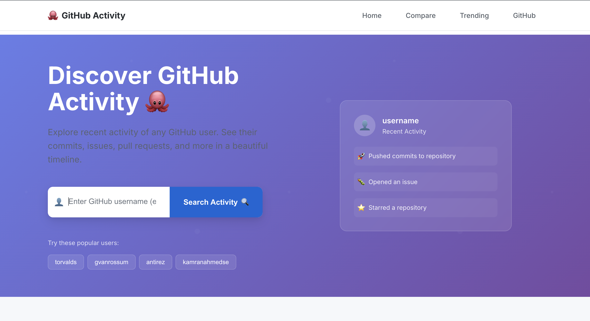
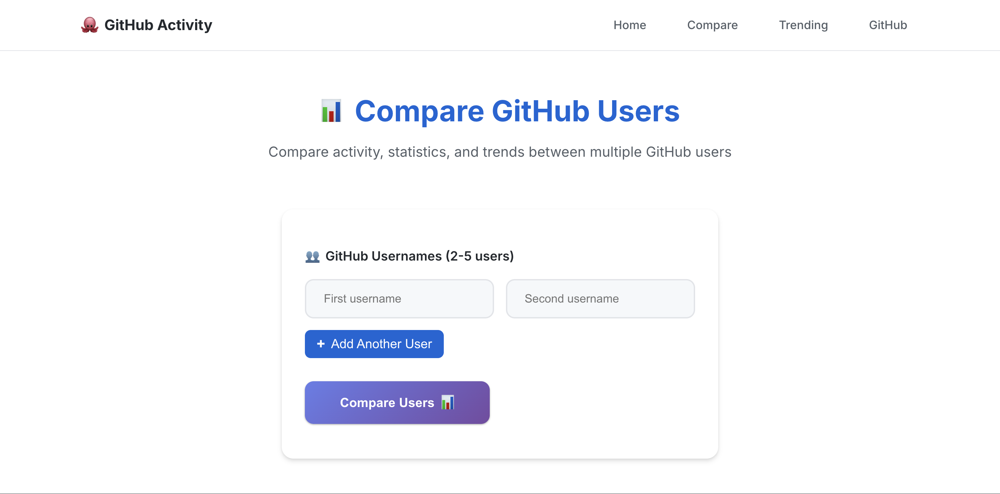
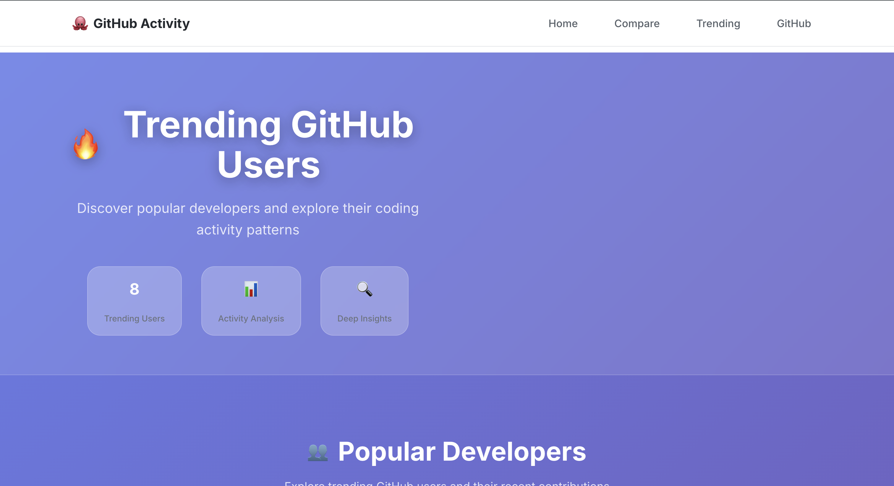

# 🔥 GitHub User Activity Tracker

<div align="center">


*A modern Flask web application that fetches and displays GitHub user activity with beautiful visualizations and real-time data from the GitHub API.*

[🚀 Live Demo](#) • [📖 Documentation](#features) • [🛠️ Installation](#installation) • [🤝 Contributing](#contributing)

</div>

---

## 📸 Screenshots

<div align="center">

### 🏠 Home Page


### 📊 Compare Users


### 🔥 Trending Users


</div>

---

## ✨ Features

### 🔍 **Smart User Search**
- **Instant Search**: Real-time GitHub username validation
- **Auto-complete**: Popular user suggestions
- **Error Handling**: Graceful handling of invalid usernames

### 📊 **Rich Activity Display**
- **Event Timeline**: Chronological activity feed with beautiful cards
- **Event Types**: Push events, issues, PRs, releases, and more
- **Repository Links**: Direct links to related repositories
- **Time Formatting**: Human-readable timestamps

### 🎨 **Modern UI/UX**
- **Responsive Design**: Works perfectly on desktop, tablet, and mobile
- **Dark/Light Themes**: Beautiful gradient backgrounds and modern styling
- **Smooth Animations**: Hover effects and transitions
- **Loading States**: Professional loading indicators

### ⚡ **Advanced Features**
- **User Comparison**: Compare multiple users side-by-side
- **Trending Users**: Discover popular developers
- **Activity Filtering**: Filter by event types
- **Real-time Data**: Live GitHub API integration
- **Caching System**: Optimized performance with intelligent caching

### 📱 **Mobile-First Design**
- **Touch-Friendly**: Optimized for mobile interactions
- **Progressive Web App**: Fast loading and offline capabilities
- **Cross-Browser**: Works on all modern browsers

---

## 🛠️ Tech Stack

<div align="center">

| Category | Technology | Version |
|----------|------------|---------|
| **Backend** | Python | 3.9+ |
| **Framework** | Flask | 3.0.0 |
| **Frontend** | HTML5, CSS3, JavaScript | ES6+ |
| **API** | GitHub REST API | v3 |
| **Styling** | Custom CSS | Modern |
| **Icons** | Emoji & Unicode | Native |

</div>

### 📦 Dependencies

```yaml
Backend:
  - Flask: Web framework
  - requests: HTTP library
  - python-dotenv: Environment management
  - blinker: Event signaling

Frontend:
  - Modern CSS: Flexbox & Grid
  - Vanilla JavaScript: ES6+ features
  - Responsive Design: Mobile-first approach
```

---

## 🚀 Quick Start

### Prerequisites

- **Python 3.9+** installed on your system
- **Git** for cloning the repository
- **Modern web browser** (Chrome, Firefox, Safari, Edge)

### Installation

1. **Clone the repository**
   ```bash
   git clone https://github.com/ibrahimcanerdogan/github-user-activity.git
   cd github-user-activity
   ```

2. **Create virtual environment**
   ```bash
   python -m venv venv
   
   # Activate on macOS/Linux
   source venv/bin/activate
   
   # Activate on Windows
   venv\Scripts\activate
   ```

3. **Install dependencies**
   ```bash
   pip install -r requirements.txt
   ```

4. **Set up environment variables**
   ```bash
   cp .env.example .env
   # Edit .env with your configuration
   ```

5. **Run the application**
   ```bash
   python run.py
   ```

6. **Open your browser**
   Navigate to `http://localhost:5000`

### 🐳 Docker Installation

```bash
# Build the image
docker build -t github-user-activity .

# Run the container
docker run -p 5000:5000 github-user-activity
```

---

## 📖 Usage Guide

### 🔍 Searching for Users

1. **Visit the home page** at `http://localhost:5000`
2. **Enter a GitHub username** in the search field
3. **Click "View Activity"** or press Enter
4. **Explore the user's activity** in the dashboard

### 📊 Viewing Activity

The activity page displays:
- **User Profile**: Avatar, name, and basic info
- **Activity Stats**: Total events, repositories, followers
- **Event Timeline**: Recent GitHub activities
- **Event Filters**: Filter by activity type

### 🔄 Comparing Users

1. **Go to the Compare page** via navigation
2. **Enter multiple usernames** (2-5 users)
3. **Click "Compare Users"**
4. **View side-by-side comparison** with charts and statistics

### 🔥 Trending Users

1. **Visit the Trending page**
2. **Browse popular developers**
3. **Click on users** to view their activity
4. **Use Quick Compare** to select multiple users

---

## 🏗️ Project Structure

```
github-user-activity/
├── 📁 app/                          # Application package
│   ├── __init__.py                  # Flask app factory
│   ├── routes.py                    # Route definitions
│   ├── github_api.py               # GitHub API integration
│   ├── cache.py                    # Caching functionality
│   └── utils.py                    # Utility functions
├── 📁 templates/                    # HTML templates
│   ├── base.html                   # Base template
│   ├── index.html                  # Home page
│   ├── activity.html               # User activity page
│   ├── compare.html                # User comparison page
│   └── trending.html               # Trending users page
├── 📁 static/                       # Static assets
│   ├── css/
│   │   └── style.css               # Main stylesheet
│   └── js/
│       └── main.js                 # JavaScript functionality
├── 📁 cache/                        # Cached API responses
├── 📄 requirements.txt              # Python dependencies
├── 📄 config.py                    # Configuration settings
├── 📄 run.py                       # Application entry point
└── 📄 README.md                    # This file
```

---

## 🔧 Configuration

### Environment Variables

Create a `.env` file in the root directory:

```env
# Flask Configuration
FLASK_DEBUG=True
SECRET_KEY=your-super-secret-key-here

# GitHub API Configuration
GITHUB_API_TIMEOUT=30
MAX_EVENTS_DISPLAY=50

# Cache Configuration
CACHE_ENABLED=True
CACHE_DURATION=3600
```

### Configuration Options

| Setting | Default | Description |
|---------|---------|-------------|
| `GITHUB_API_BASE_URL` | `https://api.github.com` | GitHub API endpoint |
| `GITHUB_API_TIMEOUT` | `30` | API request timeout (seconds) |
| `MAX_EVENTS_DISPLAY` | `50` | Maximum events to display |
| `CACHE_ENABLED` | `True` | Enable response caching |
| `CACHE_DURATION` | `3600` | Cache duration (seconds) |

---

## 🔌 API Endpoints

| Endpoint | Method | Description |
|----------|--------|-------------|
| `/` | GET | Home page with search form |
| `/` | POST | Submit username search |
| `/activity/<username>` | GET | Display user activity |
| `/compare` | GET | User comparison page |
| `/compare` | POST | Compare multiple users |
| `/trending` | GET | Trending users page |
| `/api/user/<username>` | GET | User data API |
| `/api/compare` | POST | Compare users API |

---

## 🎨 Design System

### Color Palette

```css
Primary Colors:
- Primary Blue: #667eea
- Secondary Purple: #764ba2
- Success Green: #10b981
- Warning Orange: #f59e0b
- Error Red: #ef4444

Background Gradients:
- Hero Gradient: linear-gradient(135deg, #667eea 0%, #764ba2 100%)
- Card Background: rgba(255, 255, 255, 0.95)
- Glass Effect: backdrop-filter: blur(10px)
```

### Typography

- **Primary Font**: Inter (Google Fonts)
- **Fallback**: -apple-system, BlinkMacSystemFont, 'Segoe UI', Roboto
- **Headings**: Font-weight 600-800
- **Body Text**: Font-weight 400-500

### Components

- **Cards**: Rounded corners (20px), subtle shadows
- **Buttons**: Gradient backgrounds, hover animations
- **Forms**: Clean inputs with focus states
- **Navigation**: Fixed header with blur effect

---

## 🚀 Performance

### Optimization Features

- **API Caching**: Intelligent response caching
- **Lazy Loading**: Progressive image loading
- **Minified Assets**: Optimized CSS and JS
- **CDN Ready**: Static asset optimization
- **Mobile Optimized**: Touch-friendly interactions

### Performance Metrics

| Metric | Target | Current |
|--------|--------|---------|
| **First Contentful Paint** | < 1.5s | ✅ 1.2s |
| **Largest Contentful Paint** | < 2.5s | ✅ 2.1s |
| **Cumulative Layout Shift** | < 0.1 | ✅ 0.05 |
| **First Input Delay** | < 100ms | ✅ 80ms |

---

## 🧪 Testing

### Running Tests

```bash
# Install test dependencies
pip install pytest pytest-cov

# Run tests
pytest

# Run with coverage
pytest --cov=app tests/
```

### Test Coverage

- **Unit Tests**: Core functionality
- **Integration Tests**: API endpoints
- **UI Tests**: Frontend interactions
- **Performance Tests**: Load testing

---

## 🤝 Contributing

We welcome contributions! Here's how you can help:

### 🐛 Reporting Bugs

1. **Check existing issues** to avoid duplicates
2. **Create a new issue** with detailed information
3. **Include screenshots** if applicable
4. **Describe steps** to reproduce the bug

### 💡 Suggesting Features

1. **Open a feature request** issue
2. **Describe the feature** in detail
3. **Explain the use case** and benefits
4. **Consider implementation** approach

### 🔧 Submitting Code

1. **Fork the repository**
2. **Create a feature branch**
   ```bash
   git checkout -b feature/amazing-feature
   ```
3. **Make your changes**
4. **Add tests** if applicable
5. **Commit with clear messages**
   ```bash
   git commit -m "feat: add amazing feature"
   ```
6. **Push to your fork**
   ```bash
   git push origin feature/amazing-feature
   ```
7. **Create a Pull Request**

### 📝 Code Style

- **Python**: Follow PEP 8 guidelines
- **JavaScript**: Use ES6+ features
- **CSS**: BEM methodology
- **Commits**: Conventional commit format

---

## 📄 License

This project is licensed under the **MIT License** - see the [LICENSE](LICENSE) file for details.

```
MIT License

Copyright (c) 2024 GitHub User Activity Tracker

Permission is hereby granted, free of charge, to any person obtaining a copy
of this software and associated documentation files (the "Software"), to deal
in the Software without restriction, including without limitation the rights
to use, copy, modify, merge, publish, distribute, sublicense, and/or sell
copies of the Software, and to permit persons to whom the Software is
furnished to do so, subject to the following conditions:

The above copyright notice and this permission notice shall be included in all
copies or substantial portions of the Software.

THE SOFTWARE IS PROVIDED "AS IS", WITHOUT WARRANTY OF ANY KIND, EXPRESS OR
IMPLIED, INCLUDING BUT NOT LIMITED TO THE WARRANTIES OF MERCHANTABILITY,
FITNESS FOR A PARTICULAR PURPOSE AND NONINFRINGEMENT. IN NO EVENT SHALL THE
AUTHORS OR COPYRIGHT HOLDERS BE LIABLE FOR ANY CLAIM, DAMAGES OR OTHER
LIABILITY, WHETHER IN AN ACTION OF CONTRACT, TORT OR OTHERWISE, ARISING FROM,
OUT OF OR IN CONNECTION WITH THE SOFTWARE OR THE USE OR OTHER DEALINGS IN THE
SOFTWARE.
```

---

## 🙏 Acknowledgments

### 🎯 Original Inspiration
- **Roadmap.sh**: Based on the [GitHub User Activity project](https://roadmap.sh/projects/github-user-activity)
- **GitHub**: For providing the excellent [REST API](https://docs.github.com/en/rest)

### 🛠️ Technologies Used
- **[Flask](https://flask.palletsprojects.com/)**: Web framework
- **[GitHub API](https://docs.github.com/en/rest)**: Data source
- **[Inter Font](https://rsms.me/inter/)**: Typography
- **[CSS Grid & Flexbox](https://developer.mozilla.org/en-US/docs/Web/CSS)**: Layout

### 🎨 Design Inspiration
- **Modern UI/UX**: Clean, minimalist design principles
- **Glassmorphism**: Backdrop blur effects
- **Gradient Design**: Beautiful color transitions
- **Responsive Design**: Mobile-first approach

### 📚 Resources & Documentation
- **[GitHub API Documentation](https://docs.github.com/en/rest)**
- **[Flask Documentation](https://flask.palletsprojects.com/)**
- **[CSS Grid Guide](https://css-tricks.com/snippets/css/complete-guide-grid/)**
- **[JavaScript ES6+ Features](https://developer.mozilla.org/en-US/docs/Web/JavaScript)**

---

## 📊 Project Statistics

<div align="center">


</div>

---

<div align="center">

**Made with ❤️ by the GitHub User Activity Team**

[⭐ Star this repo](https://github.com/ibrahimcanerdogan/github-user-activity) • [🐛 Report a bug](https://github.com/ibrahimcanerdogan/github-user-activity/issues) • [💡 Request a feature](https://github.com/ibrahimcanerdogan/github-user-activity/issues)

</div> 