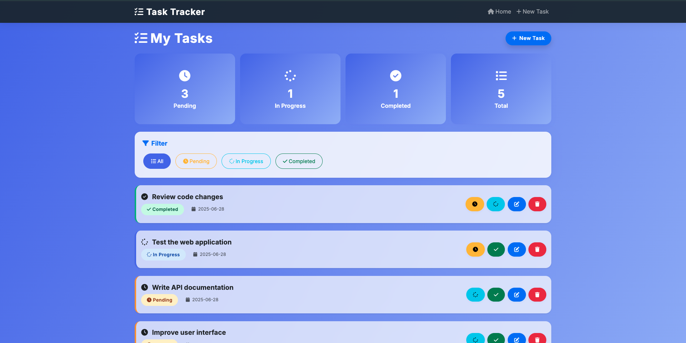
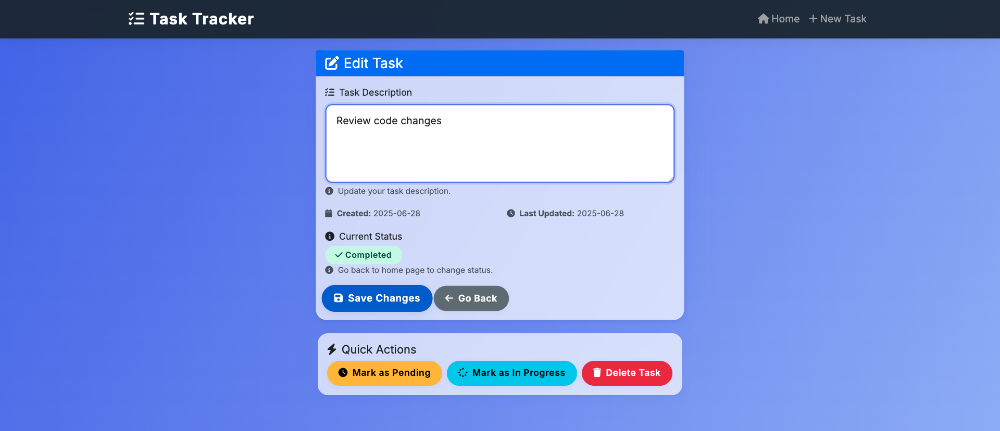

# Task Tracker - CLI & Web Application

Task Tracker is a modern task management application with both command-line (CLI) and web-based versions. Built with Python, it stores data using JSON files.

## 📸 Screenshots

### Web Interface


### Task Management


## 🌟 Features

### ✅ Core Features
- ✅ Add, update, and delete tasks
- ✅ Task status management (pending, in-progress, completed)
- ✅ List and filter tasks by status
- ✅ Persistent storage using JSON files
- ✅ Error handling and validation
- ✅ Modern and user-friendly interface

### 🖥️ CLI Version
- Quick access from command line
- All operations via terminal
- Suitable for script automation

### 🌐 Web Version
- Modern web interface (Bootstrap 5)
- Responsive design (mobile-friendly)
- Real-time statistics
- Visual status indicators
- REST API support

## 🚀 Installation

### Requirements
- Python 3.6 or higher
- Flask (for web version)

### Installation Steps

1. **Clone or download the project files**
   ```bash
   git clone <repository-url>
   cd task-tracker
   ```

2. **Install dependencies**
   ```bash
   pip3 install -r requirements.txt
   ```

## 📖 Usage

### CLI Version

#### Commands
```bash
# Add tasks
python3 task_cli.py add "Buy groceries"
python3 task_cli.py add "Complete project documentation"

# Update tasks
python3 task_cli.py update 1 "Buy groceries and cook dinner"

# Delete tasks
python3 task_cli.py delete 1

# Change status
python3 task_cli.py mark-in-progress 2
python3 task_cli.py mark-done 2

# List tasks
python3 task_cli.py list
python3 task_cli.py list todo
python3 task_cli.py list in-progress
python3 task_cli.py list done
```

#### Example Output
```bash
# Add task
python3 task_cli.py add "Buy groceries"
# Output: Task added successfully (ID: 1)

# List tasks
python3 task_cli.py list
# Output:
# ⏳ [1] Buy groceries (todo)
# 🔄 [2] Project documentation (in-progress)
# ✅ [3] Code review (done)
```

### Web Version

#### Start Application
```bash
python3 app.py
```

#### Access
- **Home Page**: http://localhost:5000
- **New Task**: http://localhost:5000/add

#### Web Interface Features
- **Home Page**: View and manage all tasks
- **Statistics**: Pending, in-progress, completed task counts
- **Filtering**: Filter tasks by status
- **Quick Actions**: One-click status changes
- **Responsive Design**: Mobile and desktop compatible

#### REST API Endpoints
```bash
# Get all tasks
GET /api/tasks

# Add new task
POST /api/tasks
Content-Type: application/json
{"description": "New task"}

# Update task
PUT /api/tasks/{id}
Content-Type: application/json
{"description": "Updated task"}

# Delete task
DELETE /api/tasks/{id}

# Change status
PUT /api/tasks/{id}/status
Content-Type: application/json
{"status": "done"}
```

## 📁 Project Structure

```
task-tracker/
├── app.py                 # Flask web application
├── task_cli.py            # CLI application
├── task_manager.py        # Core business logic
├── tasks.json             # Data storage (auto-created)
├── templates/             # HTML templates
│   ├── base.html          # Base template
│   ├── index.html         # Home page
│   ├── add_task.html      # Add task
│   └── edit_task.html     # Edit task
├── requirements.txt       # Python dependencies
├── README.md              # This file
└── demo.py                # CLI demo script
```

## 🎨 Web Interface Features

### Modern Design
- **Bootstrap 5**: Modern CSS framework
- **Font Awesome**: Icons
- **Gradient Background**: Visual appeal
- **Responsive**: Compatible with all devices

### User Experience
- **Visual Status Indicators**: Colored badges
- **Hover Effects**: Interactive buttons
- **Flash Messages**: Operation notifications
- **Confirmation Dialogs**: For delete operations

### Statistics
- **Real-time**: Live task counts
- **Categorized**: Grouped by status
- **Visual**: Icon-based cards

## 🔧 Development

### CLI Version Development
```bash
# Run demo
python3 demo.py

# Test
python3 task_cli.py --help
```

### Web Version Development
```bash
# Run in development mode
python3 app.py

# Debug mode active
# Auto-reload enabled
```

## 📊 Data Structure

Each task has the following properties:

```json
{
  "id": 1,
  "description": "Task description",
  "status": "todo|in-progress|done",
  "createdAt": "2024-01-15T10:30:00.123456",
  "updatedAt": "2024-01-15T10:30:00.123456"
}
```

## 🛠️ Technical Details

### Technologies Used
- **Backend**: Python, Flask
- **Frontend**: HTML5, CSS3, JavaScript, Bootstrap 5
- **Data Storage**: JSON files
- **Icons**: Font Awesome
- **Responsive**: Bootstrap Grid System

### Architecture
- **MVC Pattern**: Model-View-Controller
- **Separation of Concerns**: Business logic and presentation layer separation
- **RESTful API**: Standard HTTP methods
- **Error Handling**: Comprehensive error management

## 🚀 Future Features

- [ ] User authentication
- [ ] Task categories
- [ ] Task priorities
- [ ] Task dates and reminders
- [ ] Task search
- [ ] Task export (CSV, PDF)
- [ ] Task templates
- [ ] Team collaboration support

## 🤝 Contributing

1. Fork the repository
2. Create a feature branch (`git checkout -b feature/amazing-feature`)
3. Commit your changes (`git commit -m 'Add amazing feature'`)
4. Push to the branch (`git push origin feature/amazing-feature`)
5. Create a Pull Request

## 📄 License

This project is licensed under the MIT License.

## 🙏 Acknowledgments

- [roadmap.sh](https://roadmap.sh/projects/task-tracker) - For the project idea
- Bootstrap - For the modern UI framework
- Font Awesome - For the icons
- Flask - For the web framework

---

**Task Tracker** - Manage your tasks from both CLI and web! 🎯 